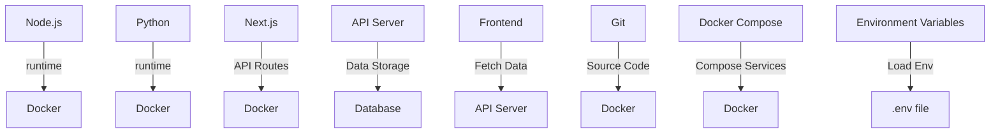

It looks like you're sharing some relevant source files, including:

1. `package.json` and `package-lock.json`: These files contain metadata about your project, such as dependencies and versions.
2. `next.config.ts`: This file configures the Next.js framework for your application, including settings for static site generation, API routes, and more.
3. `Dockerfile`: This is a script that builds a Docker image for your application, which can be used to deploy it to production.

These files seem to be related to a Node.js project, possibly using the Next.js framework, and are being deployed to a containerized environment (Docker).

Please let me know what specific questions or issues you have regarding these files or your project in general. I'll do my best to help!

_Generated by P4CodexIQ

## Architecture Diagram

_Generated by P4CodexIQ