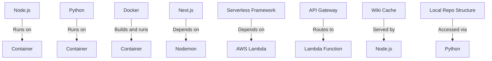

A treasure trove of files!

Here's a brief summary of each file:

1. **Relevant source files**: This is not actually a file, but rather a section header indicating that the following files are relevant to the conversation.
2. **package.json**: Not shown, but presumably contains metadata about the project, such as dependencies and scripts.
3. **next.config.ts**: Configures Next.js settings, including output options and rewrites for API routes.
4. **Dockerfile**: A script that builds a Docker image with Node.js, Python, and dependencies installed.

Some interesting points:

* The `package.json` file is not shown, but it's likely that the project has dependencies listed there.
* The `next.config.ts` file sets up Next.js settings, including rewrites for API routes. This suggests that the project uses Next.js to build a server-side rendered (SSR) web application.
* The Dockerfile is quite complex and involves installing multiple dependencies, including Node.js, Python, and various libraries. It also copies files from the local file system into the container.

If you have any specific questions or would like me to help with something, feel free to ask!

_Generated by auto_readme.py on 2025-05-28 08:18 UTC_

## Architecture Diagram

_Generated by auto_readme.py on 2025-05-28 08:18 UTC_
