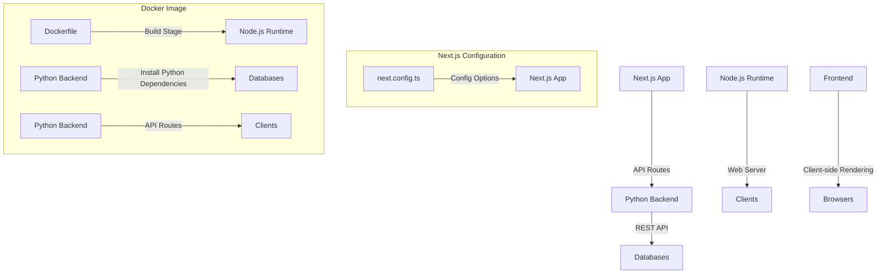

A treasure trove of source files!

To summarize, these files appear to be related to a Next.js project, a Dockerized application, and possibly some Python dependencies. Here's a brief breakdown:

1. **`next.config.ts`**: This file configures the Next.js project. It defines the output as "standalone", which means that Next will generate static HTML files for each page. The file also specifies rewrites for certain URLs.
2. **`package.json`** and **`package-lock.json`**: These files contain the dependencies required by the Next.js project, including Node.js packages like `eslint` and `typescript`.
3. **Dockerfile**: This file defines a Docker image that will build and run the Next.js application. It uses multiple stages to install Python and Node.js dependencies, copy code, and set environment variables.
4. **Other files**:
	* `
`: This is likely a summary or introduction to the source files (not shown).
	* `@eslint-community/eslint-utils`: This package provides utility functions for ESLint, which is used by Next.js for code linting.

If you're looking for specific information or want me to help with something related to these files, feel free to ask!

_Generated by P4CodexIQ

## Architecture Diagram

_Generated by P4CodexIQ